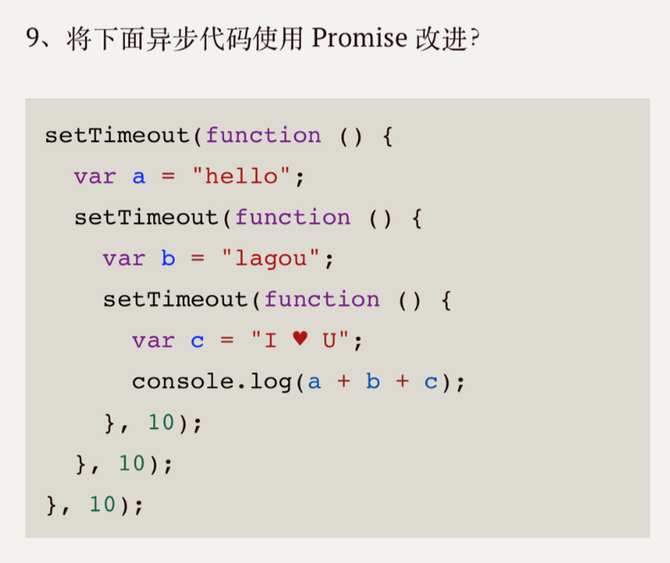

# 简答题

## 第1题
### 10
在a\[6]()运行前for循环就执行完毕了，但因为在for中i定义的是全局变量，所以所有的方法都是打印同一个变量i，在循环结束后变为10，所以不管数组内哪个元素打印的都是10


## 第2题
### 报错 未初始化
if的{}内算块级作用域，因为在内部使用let块级作用域定义了tmp，所以外部的tmp访问不到，块级作用域不会变量提升，所以在访问时还未定义


## 第3题
```javascript
var arr = [12, 34, 32, 89, 4]
console.log(Math.min(...arr)) // 4
```

## 第4题
##### var 全局作用域，块内部定义的变量能被外部访问；会变量提升，可以在声明前访问，得到的是undefined；定义的值和类型都可以被修改
##### let 块级作用域，块内部定义的变量不能被外部访问；不会变量提升，先声明后访问；定义的值和类型都可以被修改，
##### const 块级作用域，块内部定义的变量不能被外部访问；不会变量提升，先声明后访问；不允许声明过后又重新指向一个新的内存地址，但能修改属性成员

## 第5题
### 20
因为fn的调用者是obj，所以fn内部的this指向为obj，fn内部调用setTimeout(),但因为使用的是箭头函数，this的指向不会发生改变，所以还是this还是指向obj，打印obj.a，输出20

## 第6题
### 由于Symbol类型创建的值永远是唯一的，不会重复，所以使用Symbol类型作为常量,不用担心常量重复
```javascript
const type = {
    foo: Symbol('foo'),
    bar: Symbol('foo'),
    baz: Symbol('foo') // 虽然表达式一样 但返回值不一样
}

const obj = {
    start: type.baz
}

if (obj.start === type.foo){
    console.log('foo')
}else if (obj.start === type.bar) {
    console.log('bar')
}else if (obj.start === type.baz) {
    console.log('baz')  // baz
}
```
### 还能模拟对象的私有成员，在模块内定义一个变量为Symbol类型，用变量作为对象的属性名，导出这个对象无法在其他模块被修改，例如：
```javascript
// a.js
const type = Symbol() // 定义在a文件的Symbol值外界无法拿到
const obj = {
    [type]: 'type',
    getType(){
        return this[type]
    }
}
// b.js
obj.getType() // 只能拿到值而无法修改值
```

## 第7题
### 浅拷贝：复制目标对象的内存地址作为新对象的内存地址，因为新对象和目标对象的内存地址相同，所以当一个对象内的属性值发生改变时，另一个对象内的属性也会相对应的改变
### 深拷贝：复制目标对象在内存中的数据保存在内存的新地址中，并将新的内存地址返回，当对象的值改变时，另一个数据不变

## 第8题
### 异步编程：因为JavaScript是单线程的，所以所有的代码是排队按顺序运行的，只有等上一步结束才能继续，而异步编程则是在上一步代码开启后马上进入下一步执行，在上步代码结束后再执行对应的回调，在耗时很大的任务时采用异步编程只要开启就能进行下一个任务，无需等待执行结果，避免阻塞
### Event loop：
  1. 将同步任务放入执行栈执行，异步代码在API注册回调，当触发回调时将回调添加到任务队列中
  2. 在每次执行栈代码全部运行结束后去查看任务队列中是否还有未执行的代码，如果有，出队添加到执行栈并执行代码
### 宏任务：回调队列中的任务称之为宏任务，如setTimeout setInterval
### 微任务：回调在执行栈执行结束后马上执行的代码称之为微任务，如Promise的回调、MutationObserver和node中的process.nextTick

## 第9题
```javascript
function time (a){ // 返回一个Promise对象，在定时器结束后返回成功
    return new Promise(function (resolve,reject) {
        setTimeout(() => {
            resolve(a)
        },10)
    })
}
// then方法回调中如果返回的是Promise，那后面then方法的回调会等待它的结束才会继续
time('hello ') // 10ms后执行回调并把hello作为参数传入回调
    .then(function(res){ 
        return time(res + 'lagou ') //返回带定时器的promise，等promise成功后才能继续，又10ms后将上个参数跟当前字符串lagou拼接作为参数传入回调
    }).then(function(res){
        return time(res + 'IOU') //返回带定时器的promise，等promise成功后才能继续，又10ms后将上个参数跟当前字符串IOU拼接作为参数传入回调
    }).then(function(res){
        console.log(res) // hello lagou IOU
    })
```

## 第10题
### TypeScript是JavaScript的超集，在JavaScript的基础上增加了更强大的类型系统和对es6+的支持，但Typescript无法在环境运行，最后还是会再编译成JavaScript语言，换句话说JavaScript是Typescript的基础，Typescript是JavaScript的扩展和实现

## 第11题
### 优点：Typescript功能比JavaScript更加强大，类型系统能在编译阶段就发现运行可能会出现的问题，提高效率；编译后能编译成各种版本的ECMAScript，兼容性更加强大，而且能直接使用新特性
### 缺点：多了许多JavaScript所不具备的概念，增加了学习成本，初期创建项目时会多出许多成本